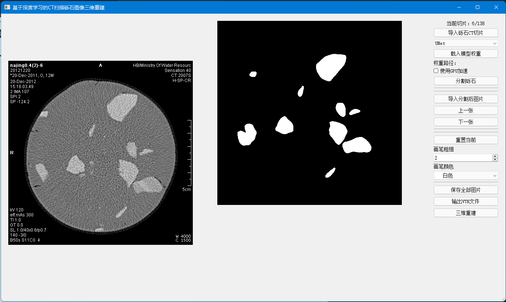
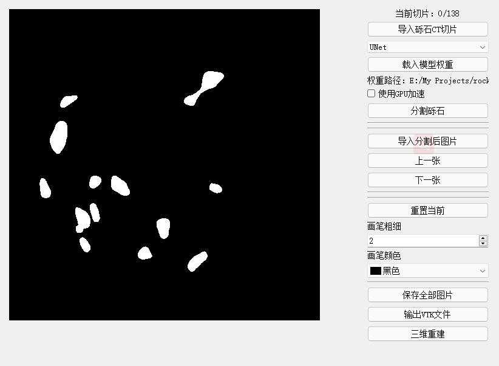
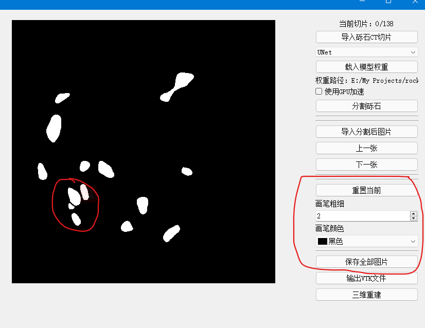
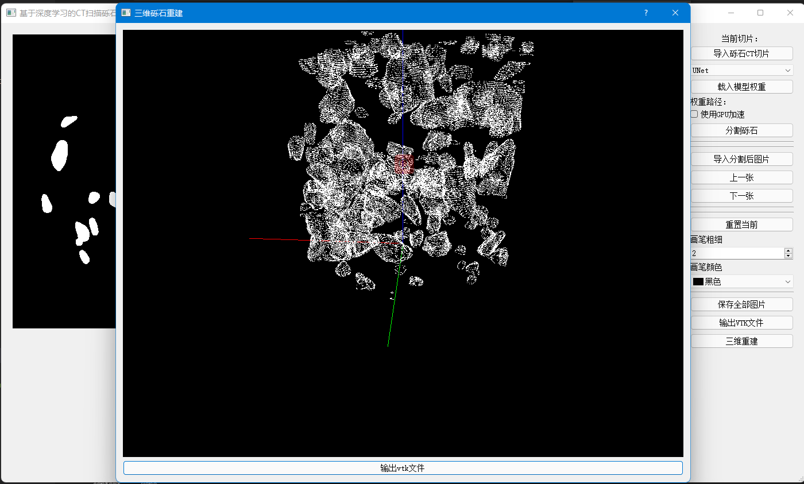

# 基于CT扫描的砾石图像三维重建

#### TODO：

- **数据集标注**
- **在U-Net中增加注意力机制**
- **使用神经网络模型进行预测100+张图像时，界面卡顿（多线程）**
- **目前使用的是PyqtGraph科学计算可视化库，计划使用VTK。但是VTK的配置问题困扰许久。**
- **使用VTK进行表面点云重建，将结果输出.vtk文件，可导入ParaView中**
- **砾石边界分组算法会栈溢出，有待修改**
- **进行模型的修正，减少人为测量误差**
- **界面GUI优化，简洁美观**


**主界面**：



**效果：**


## 深度学习技术

https://github.com/JlexZhong/pytorch-U-Net

深度卷积神经网络模型U-Net：


## 使用方法

#### 配置环境

requirement.txt

```
scipy==1.5.4
torch==1.6.0+cpu
pyqtgraph==0.11.1
numpy==1.19.5
mayavi==4.7.4
tqdm==4.42.1
pandas==1.1.5
opencv_python_headless==4.5.3.56
torchvision==0.7.0+cpu
matplotlib==3.1.2
Pillow==9.0.0
PyQt5==5.15.6
```

主目录下：

```bash
pip install -r requirement.txt
```

#### 下载预训练权重和测试用例

https://github.com/JlexZhong/CTRockImages3DReconstruc/releases

#### 导入CT影像

#### 选择神经网络模型

目前只支持UNet

#### 载入权重

#### 进行图像分割

可选择使用GPU加速

#### 结果优化

可使用画笔将粘结的砾石通过人工分开，右侧可调整画笔粗细和颜色。





#### 三维重建

 PyQtGraph可视化

效果：


