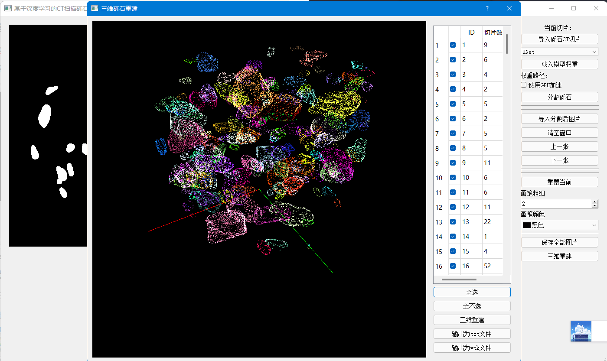
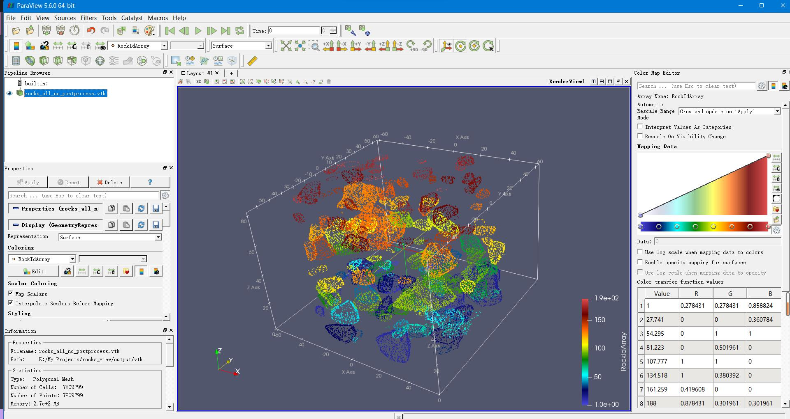

# 基于CT扫描的砾石图像三维重建

#### TODO：

- [x] **数据集标注**
- [x] **砾石分组精度问题！**
- [ ] **在U-Net中增加注意力机制**
- [ ] **使用神经网络模型进行预测100+张图像时，界面卡顿（多线程）**
- [x] **目前使用的是PyqtGraph科学计算可视化库，计划使用VTK。但是VTK的配置问题困扰许久。**
- [x] **使用VTK进行表面点云重建，将结果输出.vtk文件，可导入ParaView中**
- [x] **砾石边界分组算法会栈溢出，有待修改**
- [ ] **进行模型的修正，减少人为测量误差**
- [ ] **界面GUI优化，简洁美观**

**主界面**：


**效果：**


## 深度学习技术

https://github.com/JlexZhong/pytorch-U-Net

深度卷积神经网络模型U-Net：


## 使用方法

#### 配置环境

**python：3.6**

##### 安装PyTorch

**注意：若有Intel独显请配置好对应的GPU版本PyTorch！**

请前往pytorch官网：https://pytorch.org/get-started/previous-versions/ 

作者使用的是**PyTorch=1.6.0 CPU**版本，建议安装1.6.0版本，要根据先看的不同选择不同的CUDA版本，如下：

```
# CUDA 10.2
pip install torch==1.6.0 torchvision==0.7.0

# CUDA 10.1
pip install torch==1.6.0+cu101 torchvision==0.7.0+cu101 -f https://download.pytorch.org/whl/torch_stable.html

# CUDA 9.2
pip install torch==1.6.0+cu92 torchvision==0.7.0+cu92 -f https://download.pytorch.org/whl/torch_stable.html

# CPU only
pip install torch==1.6.0+cpu torchvision==0.7.0+cpu -f https://download.pytorch.org/whl/torch_stable.html
```

安装完PyTorch之后，

- `cd CTRockImages3DReconstruc/releases`
- `pip install -r requirements.txt`

requirements.txt的内容如下：

```
scipy==1.5.4
pyqtgraph==0.11.1
tqdm==4.42.1
pandas==1.1.5
opencv_python_headless==4.5.3.56
opencv-python==4.1.2.30
PyQt5==5.15.6
pyopengl==3.1.5
numpy==1.19.5
```

#### 下载预训练权重和测试用例

https://github.com/JlexZhong/CTRockImages3DReconstruc/releases

#### 导入CT影像

将CT扫描的土石混合体放在一个文件夹中。

#### 选择神经网络模型

目前只支持UNet

#### 载入权重

点击`载入模型权重`,打开下载好的**.pth**文件。

#### 进行图像分割

可选择使用GPU加速，默认使用CPU，速度较慢(处理速度与机器配置相关)。

#### 结果优化

可以将我们保存好的模型分割后的结果图片导入进来，点击`导入分割后图片`；

可使用画笔将粘结的砾石通过人工分开，右侧可调整画笔粗细和颜色。


#### 三维重建

 PyQtGraph交互可视化库

可选择砾石id单独显示某个或某几个砾石。

效果：



可导出**`.txt`**或**`.vtk`**格式文件。

输出**vtk**文件至ParaView软件中打开：


